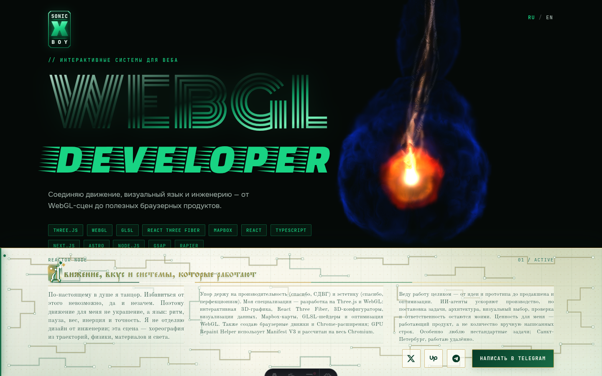

# SonicXBoy Portfolio

Open-source Astro + React Three Fiber portfolio built as one continuous piece of
WebGL choreography: a 3×3×3 assembly becomes a spinning body, separates into
symmetry classes, ignites, reforms as a reactor, and hands one physical panel to
the HTML interface.

**Live:** [sonicxboy.dev](https://sonicxboy.dev) ·
**Source kit:** [source-kit.json](https://sonicxboy.dev/source-kit.json) ·
**License:** [MIT](LICENSE)



## What is included

- Astro 7 shell with localized Russian and English routes.
- React 19 + React Three Fiber + Three.js scene.
- Deterministic cube assembly, edge roll, physical spin, orbital disassembly,
  symmetric capture, plasma ignition, reactor surface and DOM handoff.
- Portrait-mobile camera direction with authored story beats.
- Responsive horizontal information pager with measured, per-page text fitting.
- Self-hosted Church-Slavonic display typography and readable old-style body type.
- Pearl-white, malachite and antique-gold manuscript interface.
- Agent-readable project context through `AGENTS.md`, `llms.txt`, a JSON source map,
  detailed choreography documents, and an optional local MCP workspace server.

## Quick start

Requirements: Node.js `>=22.12 <23` and pnpm `11.11.0`.

```bash
git clone https://github.com/vixkosla/sonicxboy-portfolio.git
cd sonicxboy-portfolio
corepack enable
pnpm install --frozen-lockfile
pnpm dev
```

Open `http://localhost:4321/`. Build the static production output with:

```bash
pnpm build
pnpm preview
```

To inspect the completed information card immediately during local development:

```text
http://localhost:4321/?plasma-preview=card
```

## Source map

| Area | Main source |
| --- | --- |
| Page shell, metadata, responsive layout and card palette | `src/layouts/HomePage.astro` |
| R3F canvas, scene clock, choreography and DOM handoff | `src/components/HeroScene.tsx` |
| RU/EN copy and public URLs | `src/i18n.ts` |
| Mobile camera story | `src/lib/MobileCameraStory.ts` |
| Precomputed assembly paths | `src/lib/trajectoryData.ts` |
| Assembly and spin simulations | `src/lib/LayeredAssembly.ts`, `src/lib/SpinSimulation.ts` |
| Plasma, fire and flash shaders | `src/lib/FireEffect.ts` |
| Reactor material and circuit surface | `src/lib/ReactorMetamaterial.ts` |
| Full motion specification | `docs/animation-choreography.md` |
| Recreate/customize guide | `docs/recreate.md` |
| Machine-readable source map | `public/source-kit.json` |

## Recreate your own version

Start with [docs/recreate.md](docs/recreate.md). It explains which parts are identity,
which parts are reusable systems, how the motion clocks relate, where the palette and
typography live, how mobile camera shots are authored, and how to verify performance
and responsive behavior.

The shortest safe customization path is:

1. Replace brand, contacts, metadata and copy in `BrandMark.astro`, `i18n.ts`, and
   `HomePage.astro`.
2. Change card-local CSS tokens beginning with `--card-` before editing individual
   selectors.
3. Tune choreography through documented phase constants; preserve fixed-step physics
   and avoid per-frame allocation.
4. Re-author portrait shots in `MobileCameraStory.ts` after object timing is stable.
5. Test the final second separately, then build both language routes.

## AI and MCP access

This repository deliberately exposes several progressively richer context layers:

- `/llms.txt` — concise public identity and capability context.
- `/source-kit.json` — machine-readable stack, entrypoints, design tokens, debug URLs,
  and recreation checklist.
- `AGENTS.md` — implementation conventions and hot-path constraints.
- `docs/animation-choreography.md` and `docs/mobile-camera-story.md` — authored motion
  and camera specifications.
- `.vscode/mcp.json` — an optional workspace-scoped Filesystem MCP server.

In VS Code, open the repository, trust the workspace, and enable the
`sonicxboy-portfolio-source` server from the MCP panel. The config starts the official
`@modelcontextprotocol/server-filesystem` package with this clone as its only allowed
directory. The server also exposes write-capable tools, so review client confirmations
before allowing an agent to mutate your clone.

Other MCP clients can use the equivalent configuration:

```json
{
  "mcpServers": {
    "sonicxboy-portfolio-source": {
      "command": "npx",
      "args": [
        "-y",
        "@modelcontextprotocol/server-filesystem@2026.7.10",
        "/absolute/path/to/sonicxboy-portfolio"
      ]
    }
  }
}
```

No token or GitHub credential is required for local source access.

## Performance rules

- Do not allocate Three.js objects inside `useFrame`.
- Keep repeated scene objects instanced.
- Preserve the fixed-step spin integrator and delta clamp.
- Keep debug query behavior out of normal production navigation.
- Judge motion visually as well as numerically, especially the last second before the
  reactor panel becomes HTML.

## Public identity and derivatives

The code is intentionally reusable under the MIT License. `SonicXBoy`, the personal
copy, contact URLs, logo treatment and project claims identify the original author;
replace them when publishing a derivative instead of presenting a clone as the
original portfolio.

## Русское резюме

Это открытый исходный код портфолио SonicXBoy: Astro, React Three Fiber, Three.js,
GLSL, авторская физика и хореография, мобильная режиссура камеры и адаптивная
бело-зелёно-золотая информационная карточка. Для воспроизведения похожего сайта
начните с [подробного руководства](docs/recreate.md), а для подключения ИИ-агента —
с `AGENTS.md`, `public/source-kit.json` и `.vscode/mcp.json`.

## License

[MIT](LICENSE) © 2026 SonicXBoy
